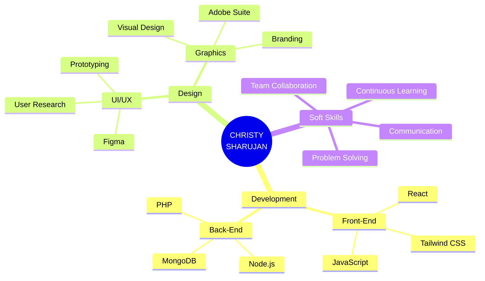

<div align="center">

# 🌌 WELCOME TO MY DIGITAL UNIVERSE 🌌


[](https://git.io/typing-svg)


</div>

---

<div align="center">

## 🎯 [ TRANSMISSION INITIALIZED ] 🎯

```ascii
╔══════════════════════════════════════════════════════════════╗
║                                                              ║
║     ██████╗ ██╗  ██╗██████╗ ██╗███████╗████████╗██╗   ██╗  ║
║    ██╔════╝ ██║  ██║██╔══██╗██║██╔════╝╚══██╔══╝╚██╗ ██╔╝  ║
║    ██║      ███████║██████╔╝██║███████╗   ██║    ╚████╔╝   ║
║    ██║      ██╔══██║██╔══██╗██║╚════██║   ██║     ╚██╔╝    ║
║    ╚██████╗ ██║  ██║██║  ██║██║███████║   ██║      ██║     ║
║     ╚═════╝ ╚═╝  ╚═╝╚═╝  ╚═╝╚═╝╚══════╝   ╚═╝      ╚═╝     ║
║                                                              ║
║              S H A R U J A N    [ ONLINE ]                   ║
║                                                              ║
╚══════════════════════════════════════════════════════════════╝
```


</div>

---

## 🔮 [ SYSTEM IDENTIFICATION ]

<div align="center">

```javascript
const christy = {
  status: "🟢 ACTIVE & AVAILABLE FOR OPPORTUNITIES",
  location: "🇱🇰 Jaffna, Sri Lanka",
  role: "Full Stack Developer & Creative Technologist",
  
  currentMission: {
    education: "BSc (Hons) IT @ SLIIT 🎓",
    focus: ["Front-End Mastery", "UI/UX Innovation", "Design Systems"],
    learning: ["Webflow", "Advanced React Patterns", "Motion Design"]
  },
  
  impact: {
    designEngagement: "+30% 📈",
    projectsShipped: "10+ 🚀",
    technologiesMastered: "15+ 💻"
  }
};
```

</div>

<div align="center">

</div>

---

## ⚡ [ TECH ARSENAL ] 

<div align="center">

### 🎨 FRONT-END PROTOCOLS


### ⚙️ BACK-END SYSTEMS


### 🎭 DESIGN SUITE


</div>

<div align="center">

</div>

---

## 🚀 [ MISSION LOG // PROFESSIONAL EXPERIENCE ]

<div align="center">

```diff
╭────────────────────────────────────────────────────────────╮
│                                                            │
│  🔷 FULL STACK DEVELOPER @ Matrix Mantra                  │
│     └─ Sep 2025 → Present  [ ACTIVE DEPLOYMENT ]          │
│     └─ Building scalable web applications                 │
│     └─ Tech: ReactJS • Node.js • Modern Stack             │
│     └─ Location: Jaffna, Sri Lanka (Hybrid)               │
│                                                            │
├────────────────────────────────────────────────────────────┤
│                                                            │
│  🎨 GRAPHIC DESIGNER @ syntax9                            │
│     └─ Feb 2025 → Aug 2025  [ MISSION COMPLETE ]          │
│     └─ Creating compelling visual identities              │
│     └─ Tech: Adobe Suite • Design Systems                 │
│     └─ Location: Jaffna, Sri Lanka (Hybrid)               │
│                                                            │
├────────────────────────────────────────────────────────────┤
│                                                            │
│  ✨ GRAPHIC DESIGNER @ Save a Life NGO                    │
│     └─ Jul 2023 → Jan 2024  [ IMPACT ACHIEVED ]           │
│     └─ 📈 INCREASED ENGAGEMENT BY 30%                     │
│     └─ Delivered strategic branded assets                 │
│     └─ Tech: Graphic Design • Social Media Visual         │
│     └─ Location: Jaffna, Sri Lanka (Hybrid)               │
│                                                            │
╰────────────────────────────────────────────────────────────╯
```

</div>

<div align="center">

</div>

---

## 💎 [ FEATURED PROJECTS // DEPLOYED SYSTEMS ]

<table>
<tr>
<td width="50%">

### 🍕 Food Delivery Platform
```yaml
Status: ✅ Deployed
Stack: 
  - PHP
  - MongoDB
  - JavaScript
  - Responsive Design
  
Features:
  ⚡ Real-time order tracking
  📦 Admin dashboard
  🎨 Mobile-optimized UI
  🔐 Secure authentication
```

</td>
<td width="50%">

### 👟 Nike Store UI/UX
```yaml
Status: ✅ Prototype Complete
Stack:
  - Figma
  - UI/UX Design
  - Prototyping
  
Features:
  🎨 High-fidelity mockups
  📱 Mobile-first design
  ✨ Micro-interactions
  🎯 Conversion-optimized
```

</td>
</tr>
<tr>
<td width="50%">

### 🌐 Responsive Web Portfolio
```yaml
Status: ✅ Live
Stack:
  - React
  - Tailwind CSS
  - Modern JS
  
Features:
  ⚡ Lightning-fast
  📱 Fully responsive
  ♿ WCAG compliant
  🎨 Modern UI/UX
```

</td>
<td width="50%">

### 🎨 Design System Library
```yaml
Status: 🔄 In Progress
Stack:
  - Figma Components
  - Design Tokens
  - Documentation
  
Features:
  🧩 Reusable components
  🎨 Brand consistency
  📚 Documentation
  🔄 Version controlled
```

</td>
</tr>
</table>

<div align="center">

</div>

---

## 🎓 [ KNOWLEDGE BASE // CREDENTIALS ]

<div align="center">

```
┌─────────────────────────────────────────────────────────┐
│                                                         │
│  🏛️  SLIIT                                             │
│      Sri Lanka Institute of Information Technology      │
│      ├─ BSc (Hons) Information Technology               │
│      ├─ Specialization: Software Development            │
│      └─ May 2023 → Present                              │
│                                                         │
│  🏫  Jaffna Hindu College                               │
│      ├─ Secondary Education                             │
│      └─ Foundation in Technology & Innovation           │
│                                                         │
└─────────────────────────────────────────────────────────┘
```

</div>

<div align="center">

</div>

---

## 🧠 [ CURRENT LEARNING PROTOCOLS ]

<div align="center">

| 🎯 Technology | 📊 Progress | 🔥 Priority |
|--------------|-------------|-------------|
| **Webflow** | ████████░░ 80% | 🔴 HIGH |
| **Advanced React** | ███████░░░ 70% | 🔴 HIGH |
| **Motion Design** | ██████░░░░ 60% | 🟡 MEDIUM |
| **Design Systems** | ████████░░ 80% | 🔴 HIGH |
| **Performance Opt** | █████░░░░░ 50% | 🟡 MEDIUM |


</div>

---

## 🌟 [ CORE COMPETENCIES ]

<div align="center">



</div>

<div align="center">

</div>

---

## 📡 [ COMMUNICATION CHANNELS ]

<div align="center">

<a href="https://www.linkedin.com/in/christy-sharujan-7b8407279">
  
</a>
<a href="https://www.kaggle.com/christysharujan">
  
</a>
<a href="https://www.instagram.com/c.sharujan_07">
  
</a>
<a href="https://x.com/christycs07">
  
</a>
<a href="https://www.facebook.com/share/1DLhnTTbXg/?mibextid=wwXIfr">
  
</a>
<a href="mailto:sharujan.save@gmail.com">
  
</a>

<!-- After header -->
<!-- Replace your broken GIFs with these -->

<!-- Header divider -->
<!-- Spider-Man swinging -->


</div>

---

## 🎯 [ MISSION OBJECTIVES // OPEN TO OPPORTUNITIES ]

<div align="center">

```typescript
interface OpportunityTargets {
  roles: string[];
  type: string[];
  interests: string[];
  availability: string;
}

const seeking: OpportunityTargets = {
  roles: [
    "💻 Front-End Developer",
    "🚀 Full-Stack Developer", 
    "🎨 UI/UX Designer",
    "🌟 Creative Technologist"
  ],
  type: [
    "Internships",
    "Full-time Positions",
    "Collaborative Projects",
    "Freelance Opportunities"
  ],
  interests: [
    "Modern Web Technologies",
    "Design Systems",
    "User Experience",
    "Creative Development"
  ],
  availability: "🟢 IMMEDIATELY AVAILABLE"
};
```

### 📬 Contact Protocol

```
📧 Primary: sharujan.save@gmail.com
🔗 LinkedIn: /christy-sharujan-7b8407279
💬 Let's build something extraordinary together!
```

</div>

<div align="center">

</div>

---

## 💡 [ SYSTEM PHILOSOPHY ]

<div align="center">

```
╔════════════════════════════════════════════════════════════╗
║                                                            ║
║  "Design is not just what it looks like and feels like.   ║
║   Design is how it works."                                ║
║                                        — Steve Jobs        ║
║                                                            ║
║  "Code is poetry written in logic."                       ║
║                                        — Anonymous         ║
║                                                            ║
║  "First, solve the problem. Then, write the code."        ║
║                                        — John Johnson      ║
║                                                            ║
╚════════════════════════════════════════════════════════════╝
```

</div>

<div align="center">

</div>

---

## 🚀 [ ACHIEVEMENT METRICS ]

<div align="center">

| 🎯 Metric | 📊 Value | 📈 Impact |
|-----------|----------|-----------|
| **Event Engagement** | +30% | 🔥🔥🔥 |
| **Projects Delivered** | 10+ | ✅✅✅ |
| **Technologies Mastered** | 15+ | 💪💪💪 |
| **Design Assets Created** | 100+ | 🎨🎨🎨 |
| **Code Commits** | 500+ | 💻💻💻 |

</div>

<div align="center">

</div>

---

<div align="center">

## ⚡ [ POWER STATS ] ⚡

```
Coding Power:     ███████████████████░  95%
Design Skills:    ██████████████████░░  90%
Problem Solving:  ████████████████████  100%
Team Work:        ███████████████████░  95%
Learning Speed:   ████████████████████  100%
```


</div>

---

<div align="center">

## 🌟 [ TRANSMISSION COMPLETE ] 🌟

```
┌──────────────────────────────────────────────────────────┐
│                                                          │
│     Thank you for visiting my digital universe! 🚀       │
│                                                          │
│     > Ready to collaborate?                              │
│     > Have an exciting project?                          │
│     > Want to build something amazing?                   │
│                                                          │
│     📧 Let's connect: sharujan.save@gmail.com           │
│                                                          │
│     Status: [●] ONLINE & READY TO CREATE                 │
│                                                          │
└──────────────────────────────────────────────────────────┘
```


[](https://forthebadge.com)
[](https://forthebadge.com)
[](https://forthebadge.com)

**⭐ If you find my work interesting, consider following! ⭐**


### 🌌 *Building the Future, One Pixel & One Line of Code at a Time* 🌌

</div>
