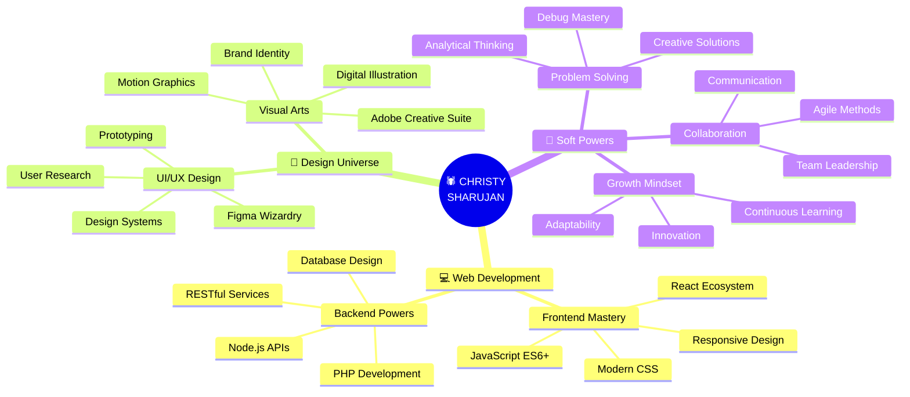

<div align="center">

# 🕷️ WITH GREAT CODE COMES GREAT RESPONSIBILITY 🕷️


[](https://git.io/typing-svg)


</div>

---

<div align="center">

## 🕸️ [ WEB-SLINGER PROTOCOL: ACTIVE ] 🕸️

```ascii
╔═══════════════════════════════════════════════════════════════════╗
║                                                                   ║
║     ███████╗██████╗ ██╗██████╗ ███████╗██████╗ ███╗   ███╗ █████╗║
║     ██╔════╝██╔══██╗██║██╔══██╗██╔════╝██╔══██╗████╗ ████║██╔══██║
║     ███████╗██████╔╝██║██║  ██║█████╗  ██████╔╝██╔████╔██║███████║
║     ╚════██║██╔═══╝ ██║██║  ██║██╔══╝  ██╔══██╗██║╚██╔╝██║██╔══██║
║     ███████║██║     ██║██████╔╝███████╗██║  ██║██║ ╚═╝ ██║██║  ██║
║     ╚══════╝╚═╝     ╚═╝╚═════╝ ╚══════╝╚═╝  ╚═╝╚═╝     ╚═╝╚═╝  ╚═╝
║                                                                   ║
║              🕷️  C H R I S T Y   S H A R U J A N  🕷️             ║
║                   [ SPIDER-SENSE: TINGLING ]                      ║
║                                                                   ║
╚═══════════════════════════════════════════════════════════════════╝
```


</div>

---

## 🎯 [ HERO IDENTIFICATION PROTOCOL ]

<div align="center">

```javascript
const webSlinger = {
  alias: "Christy Sharujan",
  status: "🔴 ACTIVE & READY FOR ACTION",
  location: "🇱🇰 Jaffna, Sri Lanka (Web-Slinging Zone)",
  superpower: "Full Stack Development & Creative Technology",
  motto: "With great code comes great responsibility",
  
  currentMission: {
    heroTraining: "BSc (Hons) IT @ SLIIT 🎓",
    focusAreas: ["Frontend Mastery", "UI/UX Innovation", "Web Architecture"],
    learningNew: ["Advanced React Patterns", "Webflow", "Motion Design"],
    sideQuests: ["Building scalable apps", "Crafting pixel-perfect designs"]
  },
  
  heroicAchievements: {
    projectsDelivered: "10+ 🎯",
    technologiesMastered: "15+ 💪",
    designEngagement: "+30% 📈",
    coffeeConsumed: "∞ ☕"
  },
  
  spiderSense: function() {
    return "Always detecting bugs before they happen! 🕷️";
  }
};

console.log(webSlinger.spiderSense());
// Output: "Always detecting bugs before they happen! 🕷️"
```

</div>

<div align="center">


### 🕸️ *Just your friendly neighborhood developer, swinging through code!* 🕸️

</div>

---

## ⚡ [ SPIDER-SUIT TECH STACK ] 

<div align="center">

### 🕸️ WEB-SLINGING TOOLS (Frontend)


```
HTML5 ████████████████████░ 95%  | Building solid foundations
CSS3  ███████████████████░░ 90%  | Styling with precision
JavaScript ██████████████████ 90%  | Making webs interactive
React ████████████████████░ 92%  | Component architecture
Tailwind ███████████████████ 88%  | Rapid UI development
```


### 🕷️ SPIDER-GADGETS (Backend)


```
Node.js ███████████████████░ 85%  | Server-side superpowers
PHP     ██████████████████░░ 82%  | Backend web-slinging
MongoDB ████████████████████ 88%  | NoSQL mastery
MySQL   ███████████████████░ 86%  | Relational databases
Git     ████████████████████ 95%  | Version control hero
```


### 🎨 DESIGN WEB-SHOOTERS


```
Figma      ████████████████████ 90%  | Prototyping wizard
Photoshop  ███████████████████░ 88%  | Visual mastery
Illustrator ██████████████████ 85%  | Vector graphics pro
Adobe XD   ████████████████░░░░ 80%  | UX design
```

</div>

<div align="center">

</div>

---

## 🦸 [ HERO'S JOURNEY // PROFESSIONAL MISSIONS ]

<div align="center">

```diff
╭─────────────────────────────────────────────────────────────────╮
│                                                                 │
│  🕷️ FULL STACK DEVELOPER @ Matrix Mantra                       │
│     ├─ 📅 Sep 2025 → Present  [ 🔴 CURRENTLY ACTIVE ]          │
│     ├─ 🎯 Building enterprise-grade web solutions              │
│     ├─ 💻 Tech Stack: React • Node.js • MongoDB • Modern APIs  │
│     ├─ 🌟 Delivering scalable, maintainable code               │
│     └─ 📍 Jaffna, Sri Lanka (Hybrid Mode)                      │
│                                                                 │
├─────────────────────────────────────────────────────────────────┤
│                                                                 │
│  🎨 GRAPHIC DESIGNER @ syntax9                                  │
│     ├─ 📅 Feb 2025 → Aug 2025  [ ✅ MISSION ACCOMPLISHED ]     │
│     ├─ 🎯 Crafted compelling brand identities                  │
│     ├─ 💻 Expertise: Adobe Creative Suite • UI/UX              │
│     ├─ 🌟 Designed 50+ marketing assets                        │
│     └─ 📍 Jaffna, Sri Lanka (Hybrid Mode)                      │
│                                                                 │
├─────────────────────────────────────────────────────────────────┤
│                                                                 │
│  ✨ GRAPHIC DESIGNER @ Save a Life NGO                          │
│     ├─ 📅 Jul 2023 → Jan 2024  [ 🏆 HIGH IMPACT ACHIEVED ]    │
│     ├─ 🎯 Social cause champion through design                 │
│     ├─ 📈 BOOSTED ENGAGEMENT BY 30% 🚀                         │
│     ├─ 🌟 Created 100+ impactful visual campaigns              │
│     ├─ 💻 Tech: Photoshop • Illustrator • Social Media Design  │
│     └─ 📍 Jaffna, Sri Lanka (Hybrid Mode)                      │
│                                                                 │
╰─────────────────────────────────────────────────────────────────╯
```

</div>

<div align="center">

</div>

---

## 🕸️ [ WEB-PROJECTS // HEROIC BUILDS ]

<div align="center">

<table>
<tr>
<td width="50%" valign="top">

### 🍕 Food Delivery Platform
**Mission Status:** ✅ **DEPLOYED**

```yaml
🕷️ Spider-Tech Used:
  Frontend: HTML5, CSS3, JavaScript
  Backend: PHP, MongoDB
  Features: 
    ⚡ Real-time tracking
    🔐 Secure auth system
    📱 Mobile responsive
    👨‍💼 Admin dashboard
    
🎯 Impact:
  - Smooth user experience
  - Fast order processing
  - Scalable architecture
```


</td>
<td width="50%" valign="top">

### 👟 Nike Store UI/UX
**Mission Status:** ✅ **PROTOTYPE READY**

```yaml
🎨 Design Arsenal:
  Tools: Figma, Adobe XD
  Type: E-commerce Design
  Features:
    ✨ High-fidelity mockups
    📱 Mobile-first approach
    🎯 Conversion-optimized
    🔄 Interactive prototype
    
🌟 Highlights:
  - Modern aesthetics
  - Intuitive navigation
  - Brand consistency
```


</td>
</tr>

<tr>
<td width="50%" valign="top">

### 🌐 Portfolio Website
**Mission Status:** ✅ **LIVE & SWINGING**

```yaml
⚡ Power Stack:
  Framework: React
  Styling: Tailwind CSS
  Deployment: Netlify
  Features:
    🚀 Lightning-fast
    📱 Fully responsive
    ♿ WCAG compliant
    🎨 Modern animations
    
💡 Tech Highlights:
  - Component-based
  - SEO optimized
  - Performance: 95+
```


</td>
<td width="50%" valign="top">

### 🎨 Design System Library
**Mission Status:** 🔄 **IN PROGRESS**

```yaml
🧩 System Components:
  Platform: Figma
  Type: Design Tokens
  Features:
    🎨 Reusable components
    📚 Documentation
    🔄 Version control
    🌈 Color system
    
🎯 Goals:
  - Brand consistency
  - Faster development
  - Scalable design
```


</td>
</tr>

<tr>
<td width="50%" valign="top">

### 🎮 Interactive Web Game
**Mission Status:** 🚀 **LAUNCHING SOON**

```yaml
🕹️ Game Tech:
  Engine: JavaScript Canvas
  Physics: Custom engine
  Design: Pixel art style
  Features:
    🎯 Score tracking
    🏆 Leaderboard
    🎨 Smooth animations
    📱 Touch controls
    
⚡ Performance:
  - 60 FPS gameplay
  - Responsive design
  - Low latency
```


</td>
<td width="50%" valign="top">

### 📊 Data Visualization Dashboard
**Mission Status:** 🔄 **DEVELOPMENT**

```yaml
📈 Data Powers:
  Frontend: React + D3.js
  Backend: Node.js + Express
  Database: MongoDB
  Features:
    📊 Real-time charts
    🔍 Advanced filters
    📥 Export options
    🎨 Custom themes
    
🌟 Capabilities:
  - Interactive graphs
  - Live data updates
  - Mobile optimized
```


</td>
</tr>
</table>

</div>

<div align="center">

</div>

---

## 🎓 [ TRAINING GROUNDS // HERO ACADEMY ]

<div align="center">

```
┌───────────────────────────────────────────────────────────────┐
│                                                               │
│  🏛️  SRI LANKA INSTITUTE OF INFORMATION TECHNOLOGY (SLIIT)  │
│      ├─ 🎓 BSc (Hons) Information Technology                 │
│      ├─ 🎯 Specialization: Full Stack Development            │
│      ├─ 📅 May 2023 → Present                                │
│      ├─ 🌟 Focus: Modern Web Technologies & Design           │
│      └─ 📍 Sri Lanka's Premier IT Institution                │
│                                                               │
│  🏫  JAFFNA HINDU COLLEGE                                     │
│      ├─ 📚 Secondary Education Excellence                    │
│      ├─ 🎯 Foundation in Technology & Science                │
│      ├─ 🌟 Developed problem-solving mindset                 │
│      └─ 💡 Sparked passion for innovation                    │
│                                                               │
└───────────────────────────────────────────────────────────────┘
```


</div>

---

## 🧠 [ POWER-UP PROGRESS // TRAINING MONTAGE ]

<div align="center">

### 🎯 Current Skill Development

| 🕷️ Technology | 📊 Power Level | 🔥 Priority | 🎯 Mission |
|--------------|----------------|-------------|-----------|
| **Webflow** | ████████░░ 80% | 🔴 CRITICAL | Master no-code development |
| **Advanced React** | ███████░░░ 70% | 🔴 CRITICAL | Custom hooks & patterns |
| **Motion Design** | ██████░░░░ 60% | 🟡 HIGH | GSAP & Framer Motion |
| **Design Systems** | ████████░░ 80% | 🔴 CRITICAL | Component libraries |
| **TypeScript** | █████░░░░░ 50% | 🟡 HIGH | Type-safe development |
| **Next.js** | ██████░░░░ 60% | 🟠 MEDIUM | SSR & SSG mastery |
| **Web3 & Blockchain** | ███░░░░░░░ 30% | 🟢 LEARNING | Future technologies |


### 📈 Skill Progression Map

```
Beginner ─────▶ Intermediate ─────▶ Advanced ─────▶ Expert ─────▶ Master
                                                            ↑
                                                    You are here! 🕷️
```

</div>

---

## 🎨 [ SUPERHERO SKILL MATRIX ]

<div align="center">



</div>

<div align="center">

</div>

---

## 📊 [ HERO STATISTICS // GITHUB METRICS ]

<div align="center">


### 🏆 Achievement Unlocked!

| 🎯 Metric | 📊 Score | 🔥 Rank |
|-----------|----------|---------|
| **Event Engagement** | +30% 📈 | 🥇 S-Tier |
| **Projects Shipped** | 10+ ✅ | 🥇 S-Tier |
| **Tech Stack Size** | 15+ 💪 | 🥇 S-Tier |
| **Design Assets** | 100+ 🎨 | 🥇 S-Tier |
| **Code Commits** | 500+ 💻 | 🥇 S-Tier |
| **Coffee Consumed** | ∞ ☕ | 🏆 MAX |

</div>

---

## 🕷️ [ SPIDER-SENSE // LIVE ACTIVITY ]

<div align="center">

```
⚡ CURRENTLY ACTIVE ON:

🔴 Web Development    ███████████████████░  95% 
🔴 UI/UX Design       ██████████████████░░  90%
🟡 Learning New Tech  ████████████████░░░░  80%
🟢 Open Source        ██████████░░░░░░░░░░  50%
🔵 Side Projects      ███████████████░░░░░  75%

╔════════════════════════════════════════════╗
║  🕷️ SPIDER-SENSE: ALWAYS ACTIVE           ║
║  🎯 Mission Focus: FULL STACK MASTERY      ║
║  ⚡ Energy Level: MAXIMUM                  ║
║  🔥 Motivation: UNSTOPPABLE                ║
╚════════════════════════════════════════════╝
```


</div>

---

## 📡 [ COMMUNICATION WEB // CONNECT WITH ME ]

<div align="center">

### 🕸️ Choose Your Connection Method

<a href="https://www.linkedin.com/in/christy-sharujan-7b8407279">
  
</a>
<a href="mailto:sharujan.save@gmail.com">
  
</a>
<a href="https://www.instagram.com/c.sharujan_07">
  
</a>
<a href="https://x.com/christycs07">
  
</a>
<a href="https://www.facebook.com/share/1DLhnTTbXg/?mibextid=wwXIfr">
  
</a>
<a href="https://www.kaggle.com/christysharujan">
  
</a>

### 📬 Direct Communication Protocol

```javascript
const contactMe = {
  email: "sharujan.save@gmail.com",
  linkedin: "/christy-sharujan-7b8407279",
  response_time: "⚡ Lightning Fast",
  availability: "🟢 Always Open to Opportunities",
  
  sendMessage: function(subject, message) {
    return `✅ Message received! I'll swing back to you ASAP! 🕷️`;
  }
};
```


</div>

---

## 🎯 [ MISSION OBJECTIVES // SEEKING OPPORTUNITIES ]

<div align="center">

```typescript
interface HeroicOpportunities {
  seeking: string[];
  workType: string[];
  superpowers: string[];
  availability: string;
  motivation: string;
}

const christySharu: HeroicOpportunities = {
  seeking: [
    "🕷️ Full-Stack Developer Roles",
    "🎨 UI/UX Designer Positions",
    "⚡ Frontend Developer (React Specialist)",
    "🚀 Creative Technologist",
    "💡 Innovative Startup Teams"
  ],
  
  workType: [
    "💼 Full-time Positions",
    "🎓 Internship Programs",
    "🤝 Collaborative Projects",
    "💻 Freelance Opportunities",
    "🌍 Remote Work"
  ],
  
  superpowers: [
    "Modern Web Technologies (React, Node.js)",
    "Responsive & Accessible Design",
    "UI/UX Best Practices",
    "Problem-solving & Innovation",
    "Fast Learning & Adaptation"
  ],
  
  availability: "🟢 IMMEDIATELY AVAILABLE",
  motivation: "Ready to build amazing things together! 🚀"
};

// Ready to collaborate?
console.log("Let's create something extraordinary! 🕷️");
```

### 🌟 What I Bring to Your Team

<table>
<tr>
<td align="center" width="33%">

### 💻 Technical Excellence
- Modern tech stack mastery
- Clean, maintainable code
- Best practices & patterns
- Performance optimization

</td>
<td align="center" width="33%">

### 🎨 Design Thinking
- User-centered approach
- Pixel-perfect execution
- Brand consistency
- Creative problem-solving

</td>
<td align="center" width="33%">

### 🚀 Team Player
- Clear communication
- Agile methodology
- Collaborative mindset
- Continuous improvement

</td>
</tr>
</table>

</div>

<div align="center">

</div>

---

## 💭 [ HERO'S PHILOSOPHY ]

<div align="center">

```
╔══════════════════════════════════════════════════════════════════╗
║                                                                  ║
║  "With great code comes great responsibility."                  ║
║                                  — Spider-Dev Wisdom 🕷️         ║
║                                                                  ║
║  "The best error message is the one that never shows up."       ║
║                                  — Thomas Fuchs                  ║
║                                                                  ║
║  "First, solve the problem. Then, write the code."              ║
║                                  — John Johnson                  ║
║                                                                  ║
║  "Design is not just what it looks like and feels like.         ║
║   Design is how it works."                                      ║
║                                  — Steve Jobs                    ║
║                                                                  ║
║  "The only way to do great work is to love what you do."        ║
║                                  — Steve Jobs                    ║
║                                                                  ║
╚══════════════════════════════════════════════════════════════════╝
```


</div>

---

## 🌟 [ FINAL STATS // POWER LEVELS ]

<div align="center">

```
╔════════════════════════════════════════════════════════════╗
║                    🕷️ HERO POWER LEVELS 🕷️               ║
╠════════════════════════════════════════════════════════════╣
║                                                            ║
║  Web-Slinging (Coding):     ████████████████████░  95%    ║
║  Spider-Sense (Debugging):  ████████████████████░  95%    ║
║  Wall-Crawling (Design):    ██████████████████░░  90%    ║
║  Web-Shooters (Tools):      ███████████████████░  93%    ║
║  Agility (Problem-Solving): ████████████████████  100%   ║
║  Strength (Teamwork):       ███████████████████░  95%    ║
║  Intelligence (Learning):   ████████████████████  100%   ║
║  Responsibility (Ethics):   ████████████████████  100%   ║
║                                                            ║
║  ⚡ OVERALL HERO RATING: S+ TIER ⚡                        ║
║                                                            ║
╚════════════════════════════════════════════════════════════╝
```

### 🏆 Achievement Badges Collected


</div>

<div align="center">

</div>

---

## 🎮 [ INTERACTIVE ZONE ]

<div align="center">

### 🕹️ Choose Your Action

```
╔═══════════════════════════════════════════════════════════╗
║                                                           ║
║  [1] 📧 Send a Message      → sharujan.save@gmail.com    ║
║  [2] 🤝 Connect on LinkedIn → Click Profile Link         ║
║  [3] 👀 View My Work        → Check Projects Above       ║
║  [4] ⭐ Star This Profile   → Show Some Love!            ║
║  [5] 🔄 Share This          → Spread the Word            ║
║                                                           ║
╚═══════════════════════════════════════════════════════════╝
```

### 📊 Profile Analytics


</div>

---

<div align="center">

## 🕷️ [ WEB TRANSMISSION COMPLETE ] 🕷️

```
┌────────────────────────────────────────────────────────────────┐
│                                                                │
│     🕷️ Thank you for visiting my digital web! 🕷️             │
│                                                                │
│     > Need a developer who swings into action?                 │
│     > Looking for creative solutions?                          │
│     > Want to build something amazing?                         │
│                                                                │
│     📧 Contact: sharujan.save@gmail.com                       │
│                                                                │
│     Status: [🔴] ONLINE & READY FOR MISSIONS                  │
│                                                                │
│     "Remember: With great code comes great responsibility!"    │
│                                                 — Spider-Dev 🕷️│
│                                                                │
└────────────────────────────────────────────────────────────────┘
```


[](https://forthebadge.com)
[](https://forthebadge.com)
[](https://forthebadge.com)
[](https://forthebadge.com)


### 🌌 *Your Friendly Neighborhood Developer* 🌌
### 🕷️ *Building the Web, One Line of Code at a Time* 🕷️

---

**⭐ If you find my work amazing, consider starring and following! ⭐**


</div>
